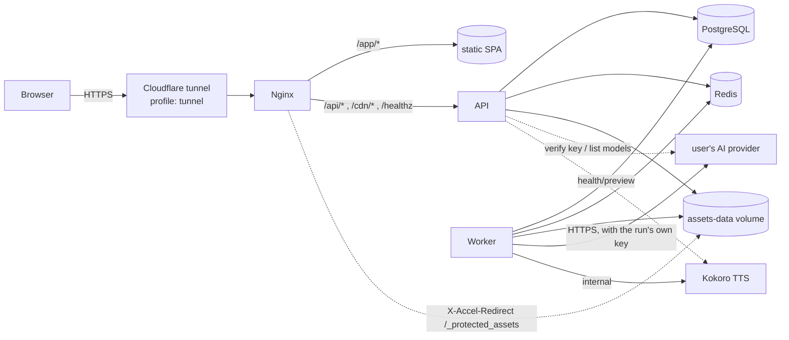

# Architecture

## Runtime topology (one VPS, Docker Compose)

Services: `nginx` (public entry, SPA, SSE passthrough, asset serving), `api` (Hono), `worker` (BullMQ processors,
compositor, exports), `migrate` (one-shot migrations, reference data, credential re-encryption), `postgres`, `redis`,
`kokoro` (profile `tts`), `mock-ai` (profile `mock`), `cloudflared` (profile `tunnel`). Postgres, Redis, Kokoro, the
worker and mock-ai are never published on host ports; only nginx binds one, on loopback by default.

There are **no server-level provider keys**: the outbound HTTPS calls above carry a key the requesting user added, so
the API and worker images hold no shared credential. See `docs/AI_PIPELINE.md`.

## Request → job → event flow

Take `POST /api/panels/:id/generate` as the example; every long AI operation follows the same five steps.

1. **API, synchronously** (`apps/api/src/routes/*`): validate the body with Zod, run the permission gate
   (`projectAccess`), check the project budget (`assertBudget`, 402 `budget_exceeded`), validate the run's
   provider/model choice against the caller's own credentials (`apps/api/src/lib/ai.ts`, 422 `credentials_required`
   when there is none), then let `GenerationPlanner` (`packages/services/src/planner.ts`) load the immutable versions,
   compile the prompt, select references and create their small derivatives.
2. **One transaction**: insert `generation_jobs`, its `generation_inputs` rows and an `outbox` row
   (`addToOutbox`), then return `202 { job }`. Nothing is enqueued outside the transaction, so a job and its
   intent-to-publish either both exist or neither does.
3. **`OutboxDispatcher`** (`packages/queue/src/index.ts`) publishes pending rows to BullMQ with
   `jobId = generation job id`. It runs as a loop in the worker every second and is also flushed by the API right
   after commit (`jobs.kick()`) so the queue latency is not a second. The select is
   `... where status = 'pending' order by created_at limit 100 for update skip locked`, so several processes can
   dispatch at once, and because BullMQ dedupes by `jobId` a crash between publishing and marking just republishes the
   same job.
4. **Worker** (`apps/worker/src/main.ts`, `processors.ts`, `handlers/*`): one BullMQ worker per queue, each with its
   own concurrency. `runGenerationJob` (`apps/worker/src/lib/runner.ts`) is the shared lifecycle — idempotent start,
   attempt counting, cancellation checks before and after the provider call, retry classification (a
   `ProviderError` decides whether it is retryable; anything else becomes an `UnrecoverableError` so BullMQ stops),
   safe failure messages and event emission.
5. **Result**: new assets plus `generation_outputs` and `ai_usage` rows, activated in a transaction that re-checks
   cancellation — cancelled output is stored but never activated — and then published on Redis pub/sub
   (`EventBus`, channel per project).
6. **SPA**: the API streams project events over SSE (`GET /api/projects/:id/events`, one dedicated Redis subscriber
   connection per stream, keep-alive ping every ~15 s, `x-accel-buffering: no`); the client invalidates the affected
   TanStack Query keys.

Queues and what they carry:

| Queue | Work | Concurrency env |
| --- | --- | --- |
| `text-ai` | story analysis, rewrite, chapter/shot planning, page prompts, narration text, panel check | `TEXT_WORKER_CONCURRENCY` (4) |
| `image-generation` | references, panels, covers | `IMAGE_WORKER_CONCURRENCY` (24) |
| `image-edit` | masked edits | `IMAGE_EDIT_WORKER_CONCURRENCY` (6) |
| `tts` | narration synthesis | `TTS_WORKER_CONCURRENCY` (4) |
| `export` | every export kind, video included, and project import | `EXPORT_WORKER_CONCURRENCY` (1) |
| `asset-processing` | thumbnails and prompt-reference derivatives on demand | fixed at 2 |
| `maintenance` | the hourly cleanup cycle | fixed at 1 |

BullMQ jobs default to 3 attempts with exponential backoff (5 s, jitter 0.5) under the Redis key prefix `om`. The
worker also re-publishes `queued` jobs whose Redis entry has disappeared, 15 s after start and every 5 minutes, so a
Redis flush or restore never strands work, and touches `/data/tmp/worker-heartbeat` every 30 s for its health check.

## Code layout

`AGENTS.md` owns the directory-by-directory list. The shape to keep in mind:

- The API is a set of domain routers (`apps/api/src/routes/*`) that validate, authorize and enqueue. Long work never
  happens in a request.
- Business logic that both the API and the worker need lives in `packages/services` — reference selection and prompt
  compilation (`planner.ts`), applying an analysis or a plan (`apply.ts`), assets, usage, budget, jobs and outbox,
  credentials, readiness, preflight, composition. There is no second implementation on either side.
- Pure functions live in `packages/domain` (layouts, bubbles, text wrapping, narration segmentation, cost, retry
  policy, permissions, video timing), with `@openmanga/domain/browser` as the web-safe subset so the Konva editor and
  the server compositor share exactly the same geometry.

## Key design decisions

- **Structured state is the source of truth.** A panel is a document (frame, spec versions, cast versions, prompt
  override, image transform); artwork is a replaceable attachment. That is what makes regeneration, migration and
  deterministic export possible.
- **Versioning everywhere that matters:** story revisions, character/location/prop versions, project style versions,
  panel spec versions, artwork asset lineage, prompt template versions. Approved and locked versions are immutable;
  a change makes a new version.
- **Deterministic composition:** page geometry, bubble outlines (`packages/domain/src/bubbles.ts`) and text wrapping
  are shared by the editor and the server SVG compositor, so what the editor shows is what the export renders. No AI
  runs at export time.
- **Narrow provider boundaries:** `TextAIProvider`, `ImageAIProvider`, `TTSProvider`, `AssetStorage`, `MailProvider`
  and `JobQueue` are the only interfaces; everything else is plain code. Which implementation runs is decided per job
  by the credential the run names (`ProviderResolver`), not by server configuration — there is no provider switch to
  set.
- **Mocking at two levels:** in-process fakes (`AI_MOCK_MODE=true`, unit and integration tests) and `apps/mock-ai`, an
  HTTP service speaking the OpenAI-compatible chat and images wire formats, which exercises the real provider code
  including its retry and error classification. `docs/TESTING.md` has the scenario list.
